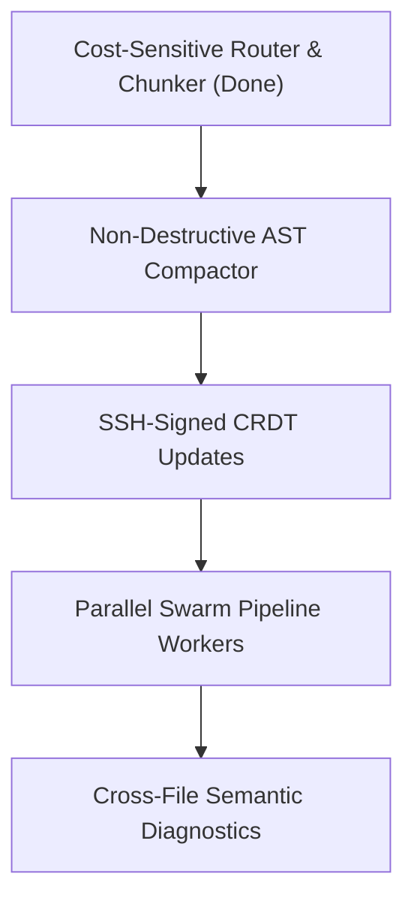

# OmniSync Architecture Critique & Strategic Roadmap

This report provides an in-depth audit of the implemented systems inside [omnisync-app](file:///home/shaanafshan2/omnisync-app/), evaluates current capabilities, exposes vulnerabilities/limitations, and details recommendations to elevate the app into a premium production-grade developer platform.

---

## 1. Core Feature Review & Critique

### 🧠 Category A: MEMORY & RAG
* **Current State**:
  * Granular AST-based semantic chunking groups top-level definitions.
  * TF-IDF sparse matching and Cosine similarity are fused via Reciprocal Rank Fusion (RRF).
  * Graph-RAG expands context by traversing import dependencies.
* **Critiques & Weaknesses**:
  * **Naive Import Parser**: The dependency graph scanner in `main.js` matches relative imports (e.g. `./components`) but fails to resolve typescript module aliases (e.g., `@/utils`), monorepo paths, or node dependencies.
  * **Code Tokenizer Limits**: The sparse TF-IDF tokenizer splits queries strictly on whitespace. It fails to match symbol names when users query using camelCase words (e.g., `syncInterval` matching queries for `sync` or `interval`).
* **Suggested Improvement**:
  * Upgrade the TF-IDF scanner to split code identifiers on case boundaries (e.g., `getSemanticChunks` $\rightarrow$ `["get", "Semantic", "Chunks"]`).
  * Integrate path alias resolution into the dependency scanner.

---

### 🔄 Category B: CRDT SYNCHRONIZATION
* **Current State**:
  * character-level Yjs states are hosted via websocket in `omnisyncd.js`.
  * Git hooks trigger rule syncs on commits, merges, and checkouts.
* **Critiques & Weaknesses**:
  * **Lack of Local Queue**: If a developer makes changes offline, the git hook will fail to contact the server and discard the update. There is no offline log-replay queue.
  * **Cleartext Updates (No signing)**: Any client can impersonate a developer. Updates are not verified cryptographically.
* **Suggested Improvement**:
  * **SSH Signature Verification**: Require clients to sign updates using their local SSH private key (`~/.ssh/id_rsa`). The server verifies signatures against verified keys.
  * **SQLite Sync Queue**: Implement a light queue database to store synchronization updates when offline, flushing them automatically once reconnection succeeds.

---

### 🤖 Category C: AGENTS & SWARM PIPELINE
* **Current State**:
  * Self-healing linter and test loops query LLM for automated error resolution.
  * Human-in-the-Loop gatekeeper prompts users before disk edits.
* **Critiques & Weaknesses**:
  * **Mock Swarm Orchestrator**: The "Swarm Pipeline" in `App.tsx` runs simulated timeouts and mock logs instead of executing parallel pipelines.
  * **Single-File Limit**: Self-healing loops operate in isolation on a single target file. They cannot reconcile changes across dependencies or modules.
* **Suggested Improvement**:
  * **True Parallel Swarm Pipeline**: Implement a real worker pipeline that executes lint healing, test writers, and doc generators in concurrent threads.
  * **Multi-file Diagnostics**: Pass compiler traces detailing secondary imports into the LLM context so the healer can patch both the caller and called files simultaneously.

---

### ⚡ Category D: TOKEN OPTIMIZATION
* **Current State**:
  * AST Call-Graph Pruner removes body definitions of unreferenced methods.
  * Sliding-window chat distillation compresses chat transcripts.
  * Model router scales requests between local Ollama and Cloud Gemini.
* **Critiques & Weaknesses**:
  * **AST Format Loss**: Pruning AST structures via `@babel/generator` resets file indent styles, brackets, and line spacing, creating formatting churn inside developer workspaces.
* **Suggested Improvement**:
  * **Non-destructive Compaction**: Instead of re-printing the whole file, use the AST nodes solely to find character ranges and slice the original file string directly, preserving user-specific styling.

---

## 2. Next Implementation Suggestions

### Recommendation 1: Cryptographic Update Signatures (19)
* **Goal**: Safeguard rule sharing from tampering.
* **How**: Have the git hook read the user's SSH key, sign the Yjs update payload, and verify it on `omnisyncd.js` before broadcasting.

### Recommendation 2: Parallel Swarm Worker Pipeline (8)
* **Goal**: Replace the simulated swarm logs in the UI with a real concurrent scheduler.
* **How**: Launch separate processes for linter, tests, and documentation, then merge their results.
